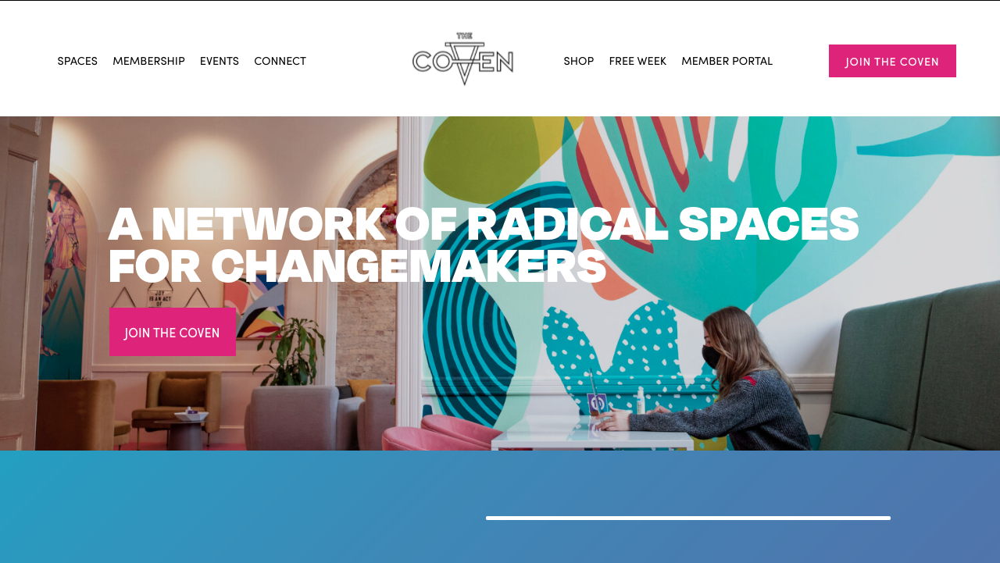

<!-- [Coven]  -->

Collaborated and contributed in ground-level development of an app from start to app store submission.

<!-- **You can visit the site here:** [Coven],[Github] -->

<!-- 

 -->

<!-- reference links --->

<!-- [coven]: https://shiftradr.com/#/ -->

<!-- [github]: https://github.com/shiftradr -->
