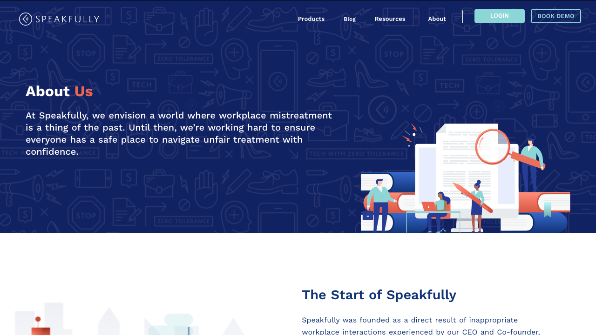

<!-- [Shiftradr]  -->

Mobile-responsive, static page utilizing a CMS to introduce users to the Speakfully team, their descriptions, and social media links.
**You can visit the site here:** [SpeakfullyAbout]

<!-- 

 -->

<!-- reference links --->

[speakfullyabout]: https://speakfully.com/about

<!-- [github]: https://github.com/shiftradr -->
