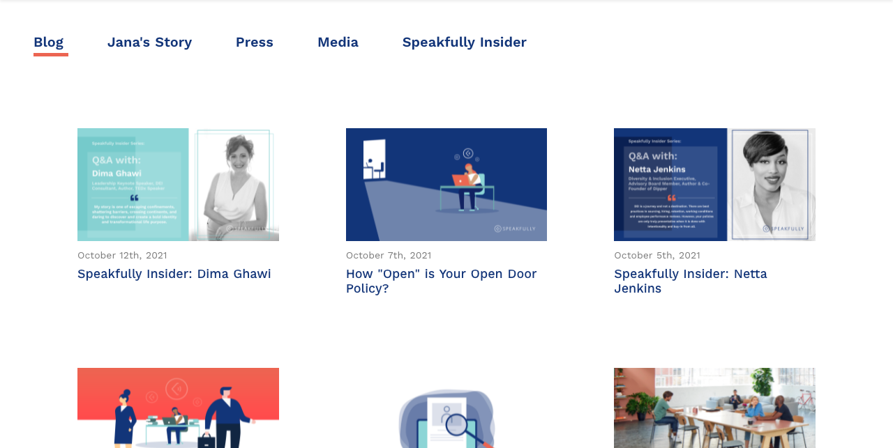

<!-- [Shiftradr] -->

Multiple blog pages utilizing reusable components to display CMS content, keeping users up-to-date with press-releases, interviews, and insider info.
**You can visit the site here:** [SpeakfullyBlog]

<!-- 

 -->

<!-- reference links --->

[speakfullyblog]: https://speakfully.com/blog

<!-- [github]: https://github.com/shiftradr -->
