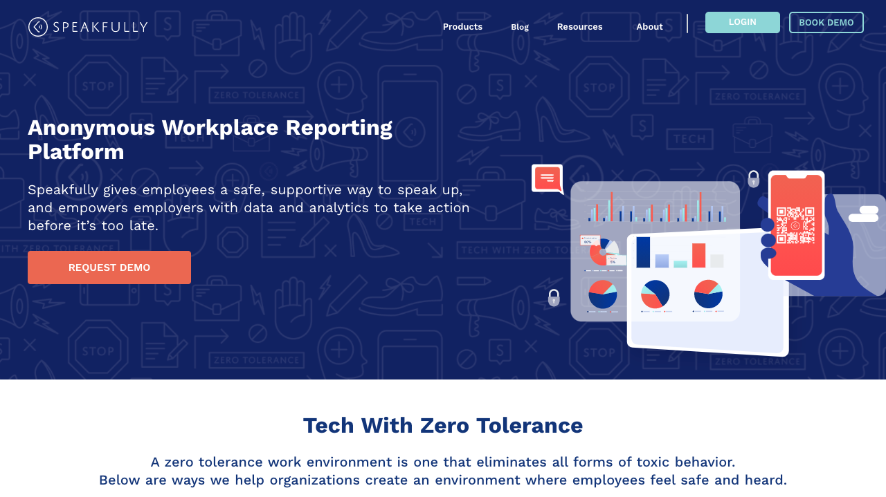
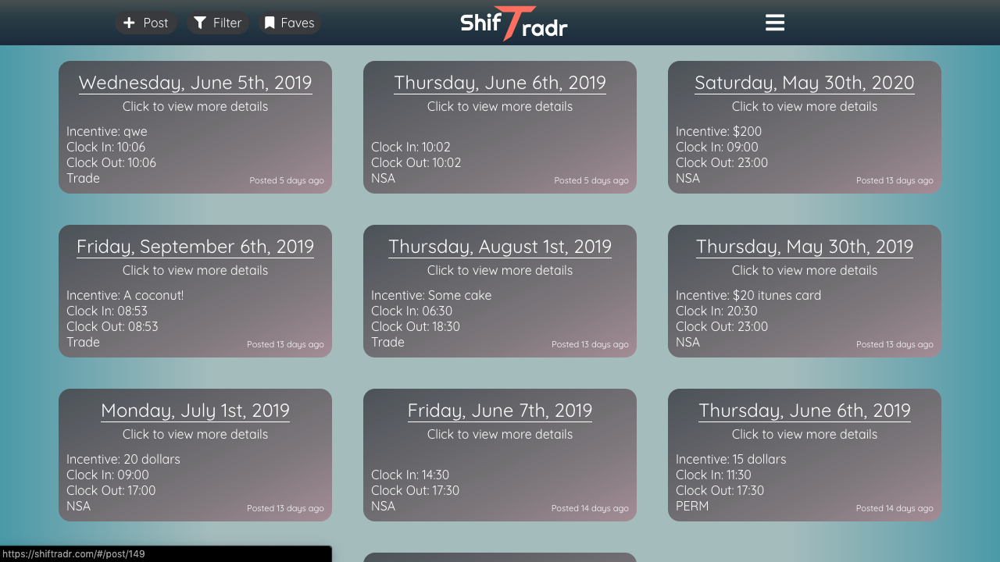
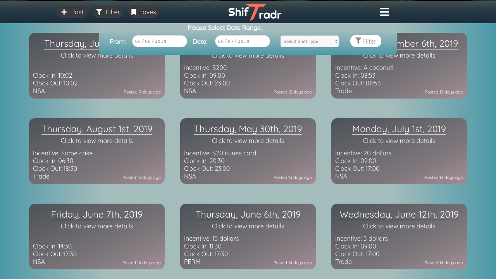
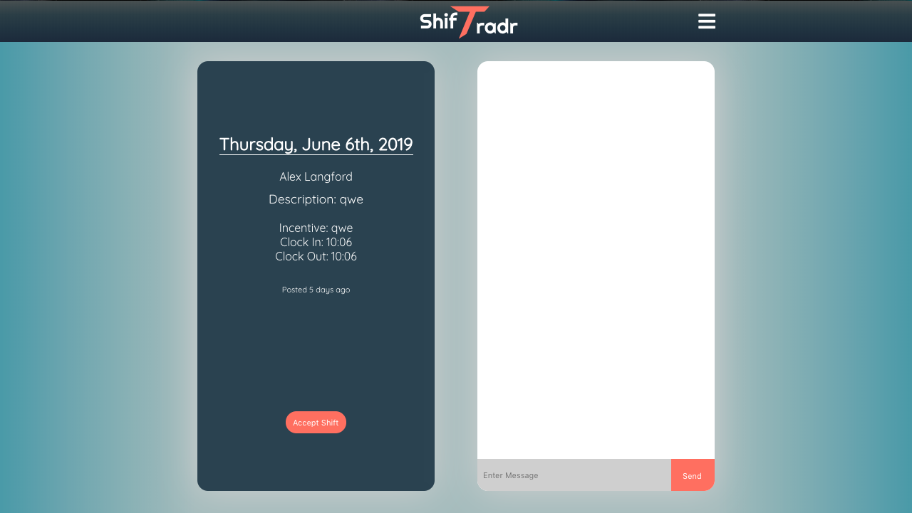
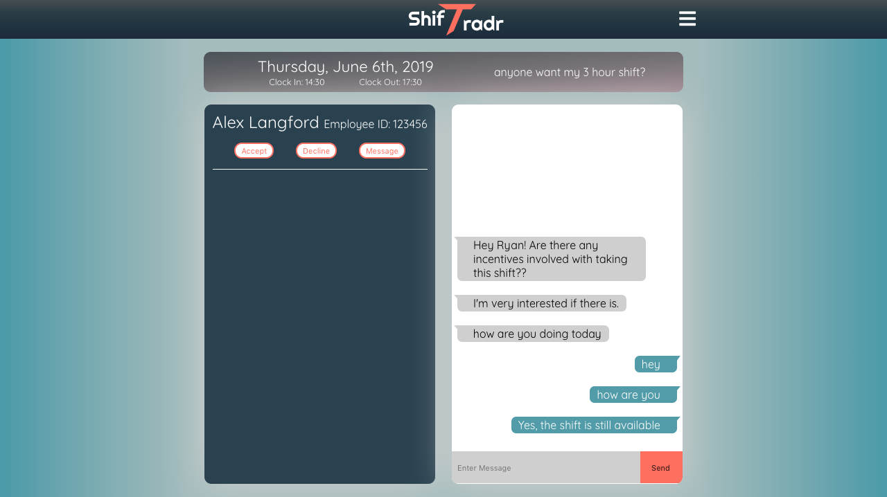

<!-- [Shiftradr] -->

Reworked, and gave a face lift to the global navigation. Created a mobile-responsive page utilizing a CMS to display everything, including the carousel contents. Utilized even/odd children to switch content order.
**You can visit the site here:** [SpeakfullyHome]

<!-- 

 -->

<!-- reference links --->

[speakfullyhome]: https://speakfully.com/

<!-- [github]: https://github.com/shiftradr -->
