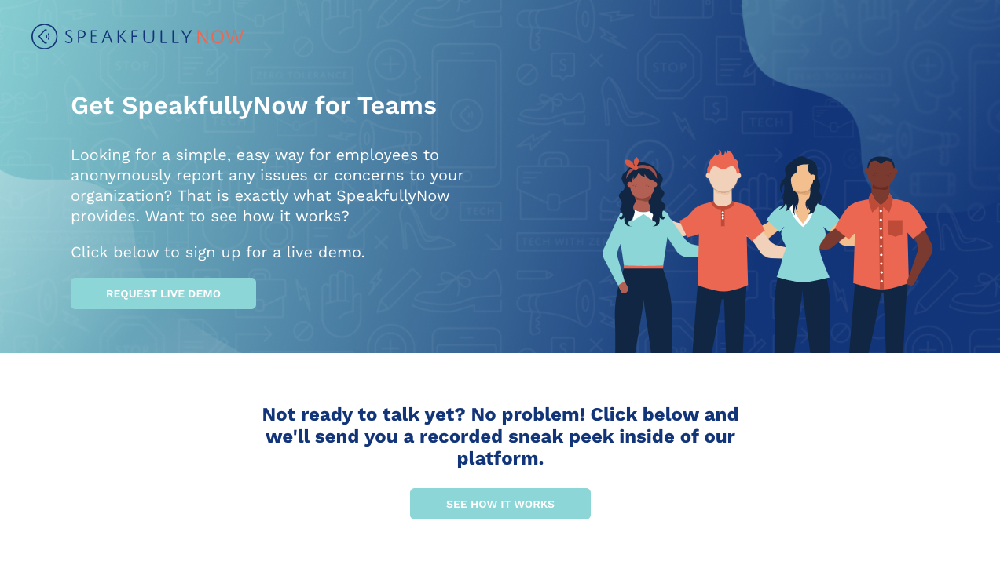

<!-- [Shiftradr] -->

Built Frontend for a web app that allows you to document, submit, and track workplace experiences.
**You can visit the site here:** [SpeakfullyNow]

<!-- 

 -->

<!-- reference links --->

[speakfullynow]: https://speakfullynow.com

<!-- [github]: https://github.com/shiftradr -->
