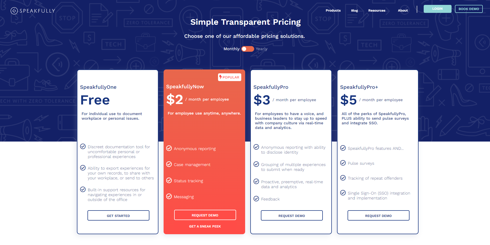

<!-- [Shiftradr] -->

Reusable pricing cards that conditionally render popularity based on a passed in CMS boolean. A conditionally rendered comparison chart, and a CRM integration. All displayed on a mobile-responsive page utilizing a CMS to display everything.
**You can visit the site here:** [SpeakfullyPricing]

<!-- 

 -->

<!-- reference links --->

[speakfullypricing]: https://speakfully.com/products/pricing

<!-- [github]: https://github.com/shiftradr -->
