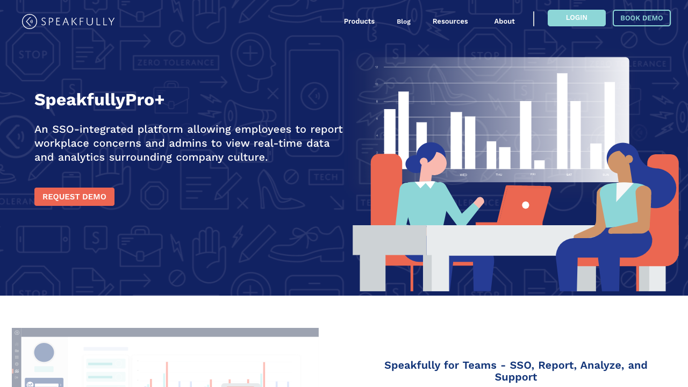

<!-- [Shiftradr] -->

Four mobile-responsive pages utlizing a CMS to display route based content. Reusing previously created reusable components(Pricing Page) to display pricing details and a CRM integration. Pricing card styling is conditionally rendered based on a passed in CMS boolean value.
**You can visit the site here:** [SpeakfullyPro]

<!-- 

 -->

<!-- reference links --->

[speakfullypro]: https://speakfully.com/products/speakfullypro

<!-- [github]: https://github.com/shiftradr -->
