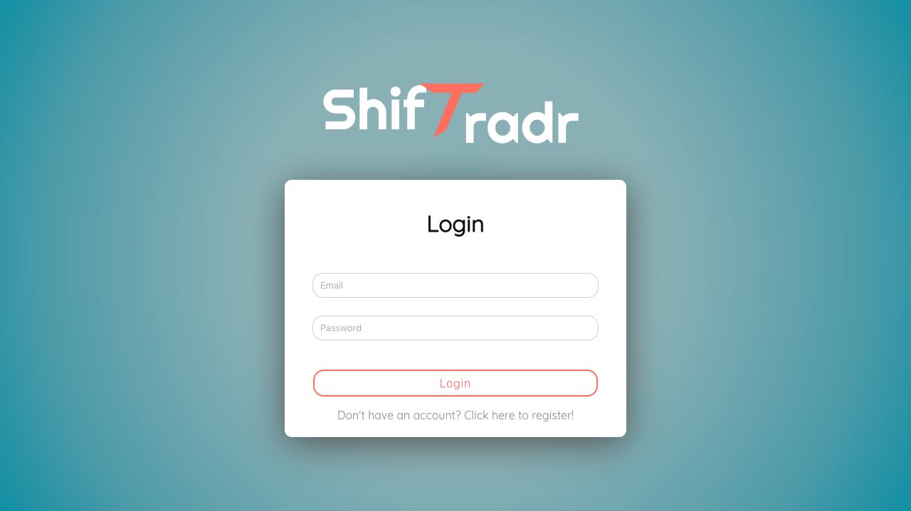

[Shiftradr]Full CRUD web application that allows employees to post and trade liability of work shifts in a streamlined fashion.

-Posts are displayed in a social media-like manner.

-Employees are updated via text with trade info.

-Tech used includes: Nodemailer and Sockets
**You can visit the site here:** [Shiftradr],[Github]

<!-- reference links --->
[Shiftradr]: <https://shiftradr.com/#/>
[Github]: <https://github.com/shiftradr>
